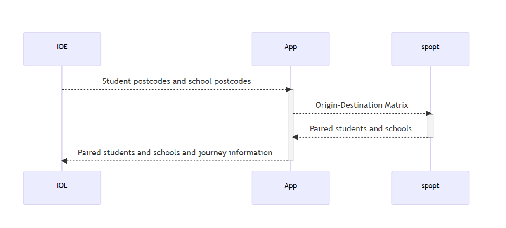

# IOE Student School Allocation

This site demonstrates the capacitated p-median location-allocation mode developed for AGILE paper 846, Developing capacitated p-median location-allocation model in the spopt library to allow UCL student
teacher placements using public transport.

This repository includes the code for the "App" to create an Origin-Destination matrix from a series of school and student postcodes (app on the figure below) and an example [Jupyter Notebook](reproducible-example.ipynb) demonstrating how this is applied in practice.



This work was presented at AGILE 2023 by Nick Bearman & Levi Wolf.

- [Presentation](agile/presentation.pdf)
- [Short Paper](agile/short-paper.pdf)

Currently (as at 06/06/2023) the new code developed for `spopt` is not integrated in to the main `spopt` version. There is currently a PR in progress for this at https://github.com/pysal/spopt/pull/374.

## Installation of pre-processing code

Install using `pip`:

```python
python -m pip install --upgrade pip
python -m pip install -e .
```

You will also need to add a TfL API key, available from
<https://api-portal.tfl.gov.uk/>. It is set in `.envrc_sample` `export TFL_APP_KEY=`

What you should do is

```sh
cp .envrc_sample .envrc
```

Then put in the key. Then run

```sh
source .envrc
```

Then re-run. You can check if it’s worked by running
`echo $TFL_APP_KEY`, and `export N_CORES=1`.

Run using

```sh
tfl example_subject
```

For more details, see the [Juypter Notebook example](reproducible-example.ipynb).
